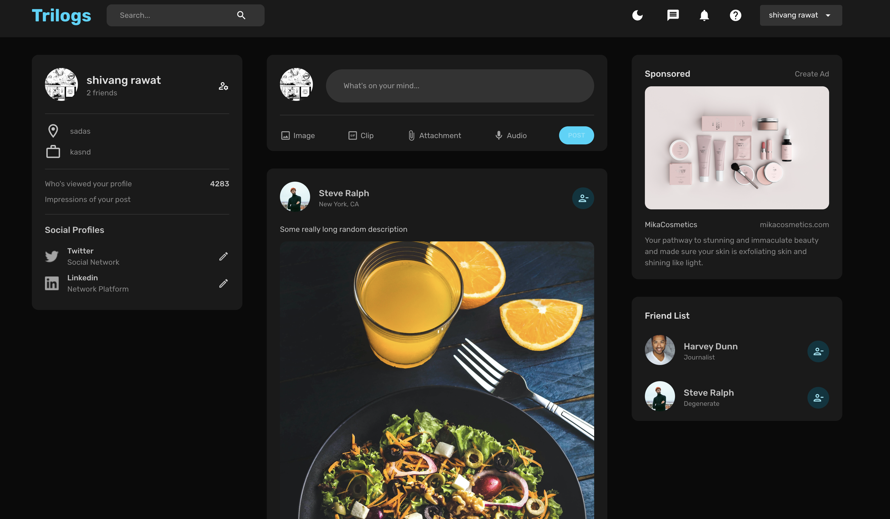

# Trilogs

Welcome to Trilogs, a social media website built using the MERN stack (MongoDB, Express.js, React.js, Node.js). Trilogs allows users to connect, share thoughts, and engage in meaningful discussions.

## Features

JWT

- **User Authentication**: Register and login to Trilogs securely to access all features.
- **Create and Edit Posts**: Share your thoughts and stories with other users by creating and editing posts.
- **Like and Comment**: Engage with other users' posts by liking them and leaving comments.
- **Follow Users**: Connect with other users and follow their activity on your posts.
- **Search and Explore**: Discover new content and explore posts from other users.
- **Responsive Design**: Enjoy a seamless experience across different devices and screen sizes.

## Technologies Used

- **MongoDB**: NoSQL database used to store user data, posts, and other information.
- **Express.js**: Web application framework used to build the backend server and APIs.
- **React.js**: JavaScript library used for building the user interface and components.
- **Node.js**: JavaScript runtime environment used to execute server-side code.
- **Redux**: State management library for managing the application's state.
- **Mongoose**: Object Data Modeling (ODM) library for MongoDB and Node.js.
- **crypto**: Authentication middleware for Node.js.
- **Socket.io**: Library for real-time, bidirectional communication between the client and the server.
- **Material UI**: UI component library for building stylish and responsive user interfaces.
